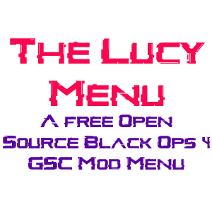

[![Contributors][contributors-shield]][contributors-url]
[![Forks][forks-shield]][forks-url]
[![Stars][stars-shield]][stars-url]
[![Issues][issues-shield]][issues-url]

<!-- PROJECT LOGO -->
 

  
  <h3 align="center">The Lucy Menu</h3>

  

	A Free, Open Source, Fully Maintained BO4 GSC Mod Menu for PC. For Battle.net, and Shield Client
     
    <a href="https://github.com/TheUnknownCod3r/BO4-Lucy-Menu/issues">Report Bug</a>
    ·
    <a href="https://github.com/TheUnknownCod3r/BO4-Lucy-Menu/issues">Request Feature</a>
	 
    <a href="https://github.com/TheUnknownCod3r/ColdWar-Lucy-Base/">Cold War Menu Base Port</a>
    ·
    <a href="https://github.com/TheUnknownCod3r/BO4-Lucy-MP-Base/">BO4 Multiplayer Menu Base Port</a>
  

<!-- TABLE OF CONTENTS -->

  
Table of Contents

  <ol>
    <li><a href="#prerequisites">Prerequisites</a></li>
    <li><a href="#usage">Usage</a></li>
    <li><a href="#roadmap">Roadmap</a></li>
    <li><a href="#contributing">Contributing</a></li>
	  <li><a href="#changelog">Changelog</a></li>
    <li><a href="#acknowledgments">Acknowledgments</a></li>
  </ol>

### Prerequisites

To use this Mod Menu, you must have Visual Studio Code, and T7 Compiler.
You can download T7 Compiler [Here](https://www.github.com/shiversoftdev/t7-compiler/releases/)
Visual Studio Code can be obtained [Here](https://code.visualstudio.com/) 
These Instructions Apply to BOTH Battle.net, and Shield Client.

(<a href="#top">back to top</a>)

<!-- USAGE EXAMPLES -->
## Usage
	To use The Mod Menu, The following instructions can be used with ease. 
	
	1. Download a copy of the Repository by clicking Code> Download Zip
	
	2. Load Visual Studio Code, Click File, Open Workspace, and load the Project.workspace in the BO4-Lucy-Menu Folder you downloaded

 	3. Click File, Preferences, Keyboard Shortcuts and search for Run Test Task. Assign an easy to remember Keybind to Inject the menu (Recommend CTRL+Shift+.)
	
 	4. Load Black Ops 4, Go into a Zombies private match Lobby, and Inject the Menu. Do NOT inject while in a game, or anywhere BUT the zombies Lobby screen, You will crash.
	
	5. Once the game loads, You should be able to Aim and Knife to open the menu. Aim to Scroll Up, Shoot to Scroll Down. F To Select, Melee to go Back. For controllers, this is LT & RS to open, LT to Scroll Up, RT to scroll Down, X to Select, Melee go back.

	6. If an option has a Slider, you can use 3 and 4 to navigate the slider. For controllers, this is Dpad Left, and Dpad Right.

(<a href="#top">back to top</a>)

<!-- ROADMAP -->
## Roadmap

- [ ] Full Map Completion of EE's
- [ ] Map Switch with character support
- [ ] More Game Modes, Model changer, More features
- [ ] Add Spawning Catalysts, Blightfathers, Stokers etc.

(<a href="#top">back to top</a>)

<!-- CONTRIBUTING -->
## Contributing

Contributions by the community are welcome, as are Bug Fixes, and suggestions. If you have an idea You wanna make and add, here's how you can contribute!

1. Fork the Project
2. Create a new branch and in the name, add -add-yourchanges
3. Apply and test your changes
4. If no issues occur, Submit a Pull request, and we'll check everything before accepting!

(<a href="#top">back to top</a>)

## Changelog

Version 1.4.7

	

		Version 1.4.7
	

	
	- Fix Crash in Stat Menu
	- Custom XP Modifier
	- Extra Unlimited Ammo Function
	- Demi God Function
	- Clean menu Structure to make Future Maintenance Easier.

Version 1.4.6

	

		Version 1.4.6
	

	
	- More Weapon Stringnames
	- Re-add Open PAP
	- Give Weapons with Player Build Kits
	- Shaolin Shuffle inspired Kill Aura
	- Fixes and Improvements across the board
	- Update Hashes in Headers
	- More coming Soon!

Version 1.4.5

	

		Version 1.4.5
	

	- Updated Several Weapon Stringnames (Credit: @TubBuddy)
	- Unlock All Now actually unlocks all Camos correctly (Fixes #24)

Version 1.4.4

	

		Version 1.4.4
	

	- Added Bull Upgrade and EE Song 2, Credit @3P1CBOSS84 
	- Added Original names for the Death of Orion and Svalinn Guard, Credit @stabz47 @ate47 

Version 1.4.3

	

		Version 1.4.3
	

	- All Specialists added, Credit @tubBuddy

Version 1.4.2

	

		Version 1.4.2
	

	- All Guns Added, Credit @ate47

Version 1.4.1

	

		Version 1.4.1
	

	- Matryoshka Dolls added, Credit @TubBuddy
	- Pegasus Strike added
	- More guns added, Credit @TubBuddy

Version 1.4

	

		Version 1.4
	

	- Winters Howl, Death Of Orion, Wunderwaffe DG-Scharfschütze, Elemental Rayguns and Alistars Folly upgrades all added, Credit @TubBuddy
	- Upgraded Weapon Varients seperated , Credit @TubBuddy
	- All Shields added , Credit @TubBuddy
	- Bullet Menu Added
	- No Recoil Added
	- Samantha Box and Stake Knife added , Credit @TubBuddy

Version 1.3.4

	

		Version 1.3.4
	

	- Full Map Teleports, Credit @TubBuddy
	- Changed several Weapon stringnames, to the upgraded Variants instead. Will separate in future

Version 1.3.3

	

		Version 1.3.3
	

	- Added Teleports for Voyage, IX, Dead of the Night, and Ancient Evil, Thanks @TubBuddy
	- Fixed Tag Der Toten Map Weapons, Wonderwaffe is now correct, as is the Wonderwaffe Sniper
	- Added Homonculus, and Monkey bombs to All supported Maps
	- Fix a crash caused by Teleport Zombies to You, my Mistake.
	- No Clip, Finally. This will be changed, when I figure out why my script crashes XD.

Version 1.3

	

		Version 1.3
	

	
	- Added Gun Game and All The Weapons
	- Fixed a Rank up issue
	- Fixed a UI error with Open All Doors / Debris
	- Altered credits to reflect new Developer
	- Finished Elixir Menu
	- Started Map Specific Weapons

Version 1.2.3

	

		Version 1.2.3 Changes
	

	
	- Started Elixir Menu
	- Cleaned up Functions and Revamped Menu Struct
	- Added Map Selection and Teleport Menu

Version 1.2.2

	

		Version 1.2.2 Changes
	

	
	- Fix Weapons Menu
	- Fix Score Menu erroring on selection
	- Remove IX Limitation
	- Added PAP Effects Menu

<!-- ACKNOWLEDGMENTS -->
## Acknowledgments

This wouldn't be possible without the following people

* [Shiversoft Dev](https://www.github.com/shiversoftdev/T7-compiler)
	without T7 Compiler, BO4 GSC Injection wouldn't be possible.

* [G1llam](https://www.github.com/G1llam/)
	Original Menu creator

* [TheUnknownCod3r](https://www.github.com/TheUnknownCod3r/)
	Taking over updates, Fixing/Maintaining and Porting new features.
	
* [SirCryptic](https://www.github.com/SirCryptic)
	Homunculus stringname, NoClip Function and Bullet Menu.
* [TubBuddy](https://www.github.com/TubBuddy/)
	Most of the Map Teleport Options, Wonder Weapons, Equipments And All Shields.
* [Ate47](https://github.com/ate47)
  	Updated Raw files I used for the menu, as well as the XP Modifier Initial code, and more.
* [Ori-Jakob](https://github.com/Ori-Jakob)
	Updated Unlimited Ammo, Demi God, and Score Only Increase Function

* several community members supplied the unhashed weapon names. 

(<a href="#top">back to top</a>)

<!-- MARKDOWN LINKS & IMAGES -->
<!-- https://www.markdownguide.org/basic-syntax/#reference-style-links -->
[contributors-shield]: https://img.shields.io/github/contributors/TheUnknownCod3r/BO4-Lucy-Menu.svg?style=for-the-badge
[contributors-url]: https://github.com/TheUnknownCod3r/BO4-Lucy-Menu/graphs/contributors
[forks-shield]: https://img.shields.io/github/forks/TheUnknownCod3r/BO4-Lucy-Menu.svg?style=for-the-badge
[forks-url]: https://github.com/TheUnknownCod3r/BO4-Lucy-Menu/network/members
[stars-shield]: https://img.shields.io/github/stars/TheUnknownCod3r/BO4-Lucy-Menu.svg?style=for-the-badge
[stars-url]: https://github.com/TheUnknownCod3r/BO4-Lucy-Menu/stargazers
[issues-shield]: https://img.shields.io/github/issues/TheUnknownCod3r/BO4-Lucy-Menu.svg?style=for-the-badge
[issues-url]: https://github.com/TheUnknownCod3r/BO4-Lucy-Menu/issues
[license-shield]: https://img.shields.io/github/license/TheUnknownCod3r/BO4-Lucy-Menu.svg?style=for-the-badge
[license-url]: https://github.com/TheUnknownCod3r/BO4-Lucy-Menu/blob/master/LICENSE.txt
